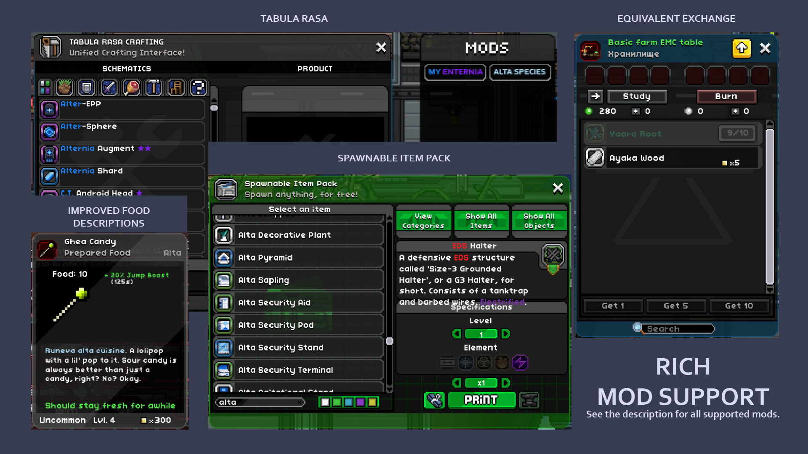
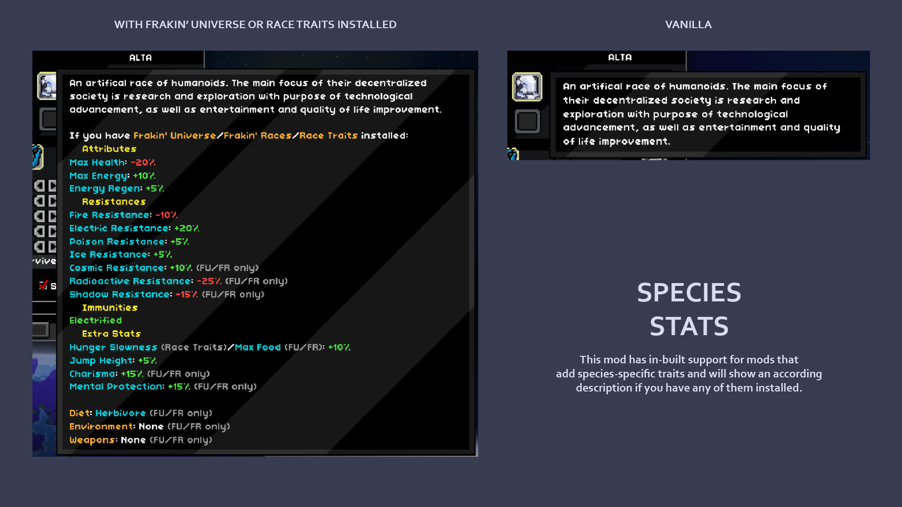
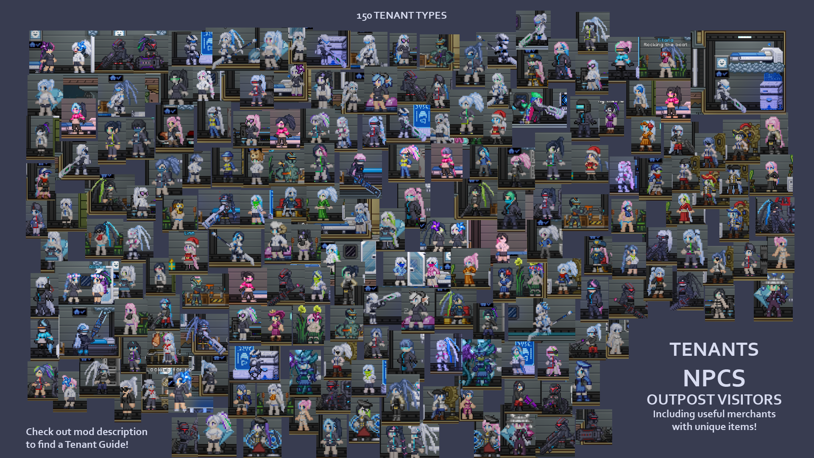

<h1 align="center">My Enternia</h1>

I made this little mod mainly for myself, but decided to share with everybody.  
This mod adds a new species -  [Alta](https://github.com/Ceterai/Enternia/wiki/Alta), 2 new planets with their own biomes, monsters, many hazards and treasure. The mod adds new unique weapons, armor, cosmetics, augments/collars, spawners, codexes, throwables and other equipment.  
All new content **can only be found on those 2 planets**, is fairly balanced, and thus doesn't interfere with normal gameplay!  
Check out the end of the description for a **rundown of new content**. Or, even better, check out the official **Wiki**!

<h4 align="center">

[>>> OFFICIAL WIKI <<<](https://github.com/Ceterai/Enternia/wiki)</h4><h4 align="center">

[>>> SUPPORT THE MOD <<<](https://www.buymeacoffee.com/ceterai)</h4><h4 align="center">

[>>> DISCORD SERVER <<<](https://discord.gg/qBZDKESdtp)</h4>
(dev updates, mod-related questions, bug reporting, and lots of emojis and stickers! ^^)
<h4 align="center">

[>>> 🇨🇳 Chinese Patch/中文翻译补丁 🇨🇳 <<<](https://steamcommunity.com/sharedfiles/filedetails/?id=3180091750)</h4>

**Version 2.3: Alta Cafe & Monster Buffet** is out! Check out the [changelog](.meta/changelog.md) for details.

Also, check out this helpful tenant guide: [My Enternia Wiki: Tenants](.meta/wiki/tenants.md)

- [Installation](#installation)
  - [Steam](#steam)
  - [Starbound Forums](#starbound-forums)
  - [GitHub](#github)
  - [Nexus Mods](#nexus-mods)
  - [Skymods](#skymods)
- [Where to start](#where-to-start)
- [Contents](#contents)
  - [Screenshots](#screenshots)
  - [Mod Content Rundown](#mod-content-rundown)
  - [Compatability](#compatability)
    - [Incompatible](#incompatible)
    - [Supported Addons](#supported-addons)
    - [Other Addon Support](#other-addon-support)
    - [Information For Modders](#information-for-modders)
    - [Information For Translators](#information-for-translators)
  - [Enhanced Tooltips](#enhanced-tooltips)
  - [Tenants](#tenants)
- [Changes](#changes)
  - [Removed Content](#removed-content)

## Installation

These are all the different ways to obtain the mod - choose whichever one you like!

### Steam

Subscribe to this mod on Steam! [Link](https://steamcommunity.com/sharedfiles/filedetails/?id=2006558650)

### Starbound Forums

Get this mod on the official Chucklefish Forums: [Link](https://community.playstarbound.com/resources/my-enternia.6252/)

### GitHub

1. Download the latest release or clone the repo;
1. Put the dowloaded/cloned folder into the `mods` folder in your Starbound directory.

> When downloading a release, you can choose between a `.zip` and a `.pak` version.

> Files, attached to releases, support direct public download links, so **can be used by servers** as well.

### Nexus Mods

- *COMING SOON*

### Skymods

> Not recommended as the mod on this resource **isn't updated by me**, so tends to be quite **outdated** and the above methods are highly preferred.

Still, you can get it here: [Link](https://catalogue.smods.ru/archives/173393)

## Where to start

To explore the worlds added by this mod, try to find new planet types around tier 3+ stars!

To start progressing in the mod content, craft an  [Alta Crafting Station](https://github.com/Ceterai/Enternia/wiki/Alta-Crafting-Station)! It should be available at the tier 2 Inventor's Table.  
From there, you'll be able to craft:

- mod equipment (armor, weapons, throwables, etc);
- other mod crafting tables;
- all mod items that can normally be only found through loot (requires max tier).

Other crafting tables include:

-  [Alta Constructor](https://github.com/Ceterai/Enternia/wiki/Alta-Constructor) for crafting objects/decorations/traps (upgrading to max tier allows you to even craft natural objects and loot tables);
-  [Alta Datacenter](https://github.com/Ceterai/Enternia/wiki/Alta-Datacenter) for crafting codexes the tell you the lore and/or explain how certain mod items work (highly recommend to read them so you don't have to visit the wiki);
-  [Alta Upgrade Station](https://github.com/Ceterai/Enternia/wiki/Alta-Upgrade-Station) for upgrading some mod items in exchange for  [Gheatsyn Shards](https://github.com/Ceterai/Enternia/wiki/Gheatsyn-Shard).

## Contents

There's a [GitHub Wiki](https://github.com/Ceterai/Enternia/wiki) with full list of contents and extensive information on each resource!

### Screenshots

You can view screenshots on the [Steam page of the mod](https://steamcommunity.com/sharedfiles/filedetails/?id=2006558650).

### Mod Content Rundown

(Scroll down for information for modders)

More information on new weapon features like press&hold, firemodes, attachments and upgrading: [My Enternia Wiki: Weapons](https://github.com/Ceterai/Enternia/wiki/Weapons)

### Compatability

1. Doesn't require any other mods to work;
1. Should be FU-compatible.

#### Incompatible

Having these mods doesn't crash the game, but using them with altas will not work.

Temporary partially **incompatible** with [Armor Adapt](https://steamcommunity.com/sharedfiles/filedetails/?id=2601606862) - using armors from this mod with it will cause lag.  
Temporary partially **incompatible** with [NpcSpawner+](https://steamcommunity.com/sharedfiles/filedetails/?id=895140470) - use [this patch](https://steamcommunity.com/sharedfiles/filedetails/?id=3250490837) if you want to create alta npcs with it.

#### Supported Addons

More about supported addons here: [Mod Support](https://github.com/Ceterai/Enternia/wiki/Modding-Mod-Support)

- [Tabula Rasa](https://steamcommunity.com/sharedfiles/filedetails/?id=737353165) (most items and objects are available at the table);
- [Spawnable Item Pack](https://steamcommunity.com/sharedfiles/filedetails/?id=733665104) (all objects and a lot of items are available here, though less than at Tabula Rasa. I would recommend using max tier Alta Crafting Station, Alta Constructor and Alta Datacenter for all recipes);
- [Equivalent Exchange](https://steamcommunity.com/sharedfiles/filedetails/?id=1790667104) (all plant-based and non-organic materials can be studied at the Farm Table and the Mine Table respectfully. Nothing fot the Hunt Table);
- [Improved Food Descriptions](https://steamcommunity.com/sharedfiles/filedetails/?id=731354142) (proper support for all effects added by this mod);
- [More Planet Info](https://steamcommunity.com/sharedfiles/filedetails/?id=1117007107) (proper support for all effects, weather and biomes of this mod);
- [True Space](https://steamcommunity.com/sharedfiles/filedetails/?id=730684624) (planets added by this mod are able to spawn near True Space stars.  [Alterash](https://github.com/Ceterai/Enternia/wiki/Alterash) can spawn as a mild/cool planet or satellite,  [Alterash Prime](https://github.com/Ceterai/Enternia/wiki/Alterash-Prime) as a cool/cold planet or satellite);
- [Race Traits](https://steamcommunity.com/sharedfiles/filedetails/?id=2622273194) (check mod screenshots for stats);
- [Frackin' Races](https://steamcommunity.com/sharedfiles/filedetails/?id=763259329)/[Frackin' Universe](https://steamcommunity.com/sharedfiles/filedetails/?id=729480149) (PARTIAL: no FU BYOS support. If you need it, you can get it here: [Alta FU Patch+](https://steamcommunity.com/sharedfiles/filedetails/?id=3048977458));
- [Quickbar Mini](https://steamcommunity.com/sharedfiles/filedetails/?id=1088459034)/[Stardust Core Lite](https://steamcommunity.com/sharedfiles/filedetails/?id=2512589532) (adds  [Alta Scanner](https://github.com/Ceterai/Enternia/wiki/Alta-Scanner) to the quick bar);
- [Scripted Artificial Intelligence Lattice (Customisable A.I.!)](https://steamcommunity.com/workshop/filedetails/?id=947429656) (adds 4 A.I. chips that modify S.A.I.L. with alta ship A.I. features and makes alta S.A.I.L. compatible with chips) - if you only want the chips and not the rest of the mod - use this instead: [Alta A.I. Chips](https://steamcommunity.com/sharedfiles/filedetails/?id=3276795992);
- [Wardrobe Interface](https://steamcommunity.com/sharedfiles/filedetails/?id=734855062) (all armor and clothing from the mod can be found in the wardrobe with proper dying options);
- [Craftable Seeds NEW](https://steamcommunity.com/sharedfiles/filedetails/?id=1938886559)/[Craftable Seeds](https://steamcommunity.com/sharedfiles/filedetails/?id=731358672) (all crops and saplings from this mod can be crafted in the Seed Maker);
- [Recipe Browser](https://steamcommunity.com/sharedfiles/filedetails/?id=2018183533) (adds all recipes and crafting stations from this mod to the interface);
- [Starburst Rework](https://steamcommunity.com/sharedfiles/filedetails/?id=3025139283) (electric protection items from this mod support effects from SR).

 

#### Other Addon Support

- Starting with 2.3.3 is now compatible with [Monsters Unique Sounds (SFX from Beta)](https://steamcommunity.com/sharedfiles/filedetails/?id=1110852235) - alta drones no longer crash with this mod installed;
- [Enhanced Storage](https://steamcommunity.com/sharedfiles/filedetails/?id=731220462) is supported with the following patch: [My Enternia Enhanced Storage Patch](https://steamcommunity.com/sharedfiles/filedetails/?id=3278292921)
- You can alter alta S.A.I.L. by installing one of the officials patches: [EDS Alta S.A.I.L.](https://steamcommunity.com/sharedfiles/filedetails/?id=3277537016), [C.T.O.S. Alta S.A.I.L.](https://steamcommunity.com/sharedfiles/filedetails/?id=3277849874).

#### Information For Modders

1. The mod uses regular Starbound folder structure so should be easy to navigate and integrate with;
1. All IDs added by the mod have a `ct_` prefix to make it impossible to conflict with IDs from other mods;
1. The mod tries to explore somewhat unusual concepts with unique names so there should be little to no idea overlap;
1. If you want to make a mod on top of this and want to learn modding-related features of this mod, visit this page: [My Enternia Wiki: Modding](https://github.com/Ceterai/Enternia/wiki/Modding);
1. Support for mods like IFD and MPI is done by generating patch files using python scripts. To learn more, visit [My Enternia Wiki: Modding - Mod Support](https://github.com/Ceterai/Enternia/wiki/Modding-Mod-Support).
1. Palettes - most factions and environments in this mod have their palettes and colors. If you wish to follwo those, you can find them in [`/.meta/world.json`](.meta/world.json) file in text form, or in the [`/.meta/palettes/`](.meta/palettes/) folder in image form.

#### Information For Translators

If you're looking to translate this mod to another language, here's the list of files & folders you should be on the lookout for:

- [`/codex`](codex)
- [`/items`](items)
- [`/monsters`](monsters)
- [`/objects`](objects)
- [`/stats/effects`](stats/effects) - mostly just effect names
- [`/interface/cockpit/cockpit.config.patch`](interface/cockpit/cockpit.config.patch) - Weather, Planet, Biome and Effect info (for the Cockpit interface and More Planets Info mod)
- [`/radiomessages/exploration.radiomessages.patch`](radiomessages/exploration.radiomessages.patch) - radio messages
- [`/species/alta.species`](species/alta.species) - species name, description, slider tooltips
- [`/species/alta_namegen.config`](species/alta_namegen.config) - possible species names list
- [`/IFD_statuseffects.config.patch`](IFD_statuseffects.config.patch) - effect info for Improved Food Descriptions mod
- [`/items/buildscripts/ct_texts.config`](items/buildscripts/ct_texts.config) - tooltip text lines used in item tooltips

> Note that items, monsters, objects, etc. can contain a `wiki` field. This field contains info only displayed in mod Wiki, so can be ignored.

There's a helpful [`/.meta/world.json`](.meta/world.json) file containing translations and explanations of most alta words in the mod, which might be useful to translators.

Starting with version [2.1.4a](https://github.com/Ceterai/Enternia/releases/tag/2.1.4a), each new version's changelog now contains a **Translation** section that goes over changes made in that version that might require attention from translators.

### Enhanced Tooltips

As mentioned in the content rundown, many different items in this mod have improved, informative tooltips. Below are some examples of that:

### Tenants

This mod add a large amount of npcs, outpost visitors and tenants. To help you navigate that, check out this helpful tenant guide: [My Enternia Wiki: Tenants](https://github.com/Ceterai/Enternia/wiki/Tenants)

## Changes

For any recent and all progress, checkout: **[Changelog](.meta/changelog.md)**  
You can also find the full list of changes on the [Steam changelog page](https://steamcommunity.com/sharedfiles/filedetails/changelog/2006558650).

### Removed Content

During development, new features appear and some features become deprecated. Usually, these features are retained, and, if possible - converted into their relevant alterniatives. With time, deprecated features are removed completely. If you wish to retain them - there's a mod that will let you do that - **My Enternia - Removed Content**:

- [Steam Workshop Link](https://steamcommunity.com/sharedfiles/filedetails/?id=3169344640)
- [Starbound Forums Link](https://community.playstarbound.com/resources/my-enternia-removed-content.6282/)

---

  

