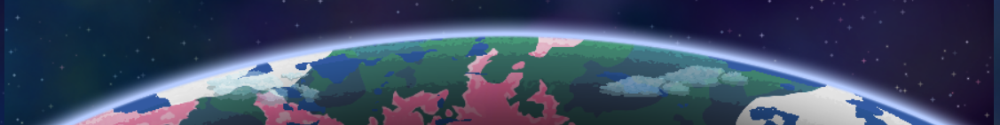
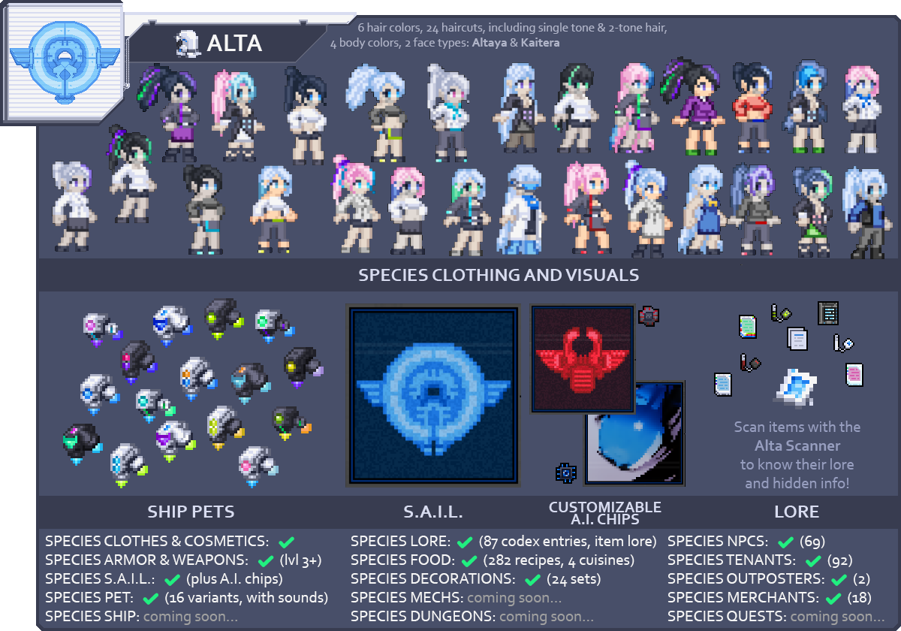
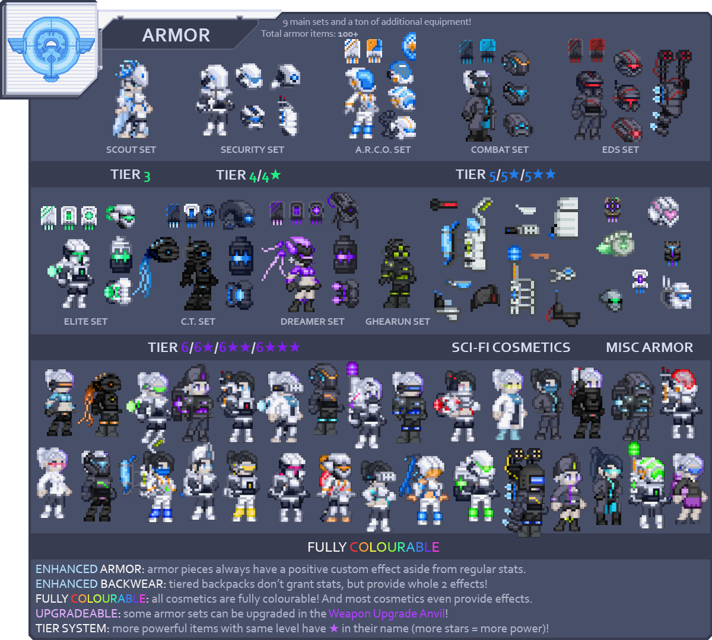
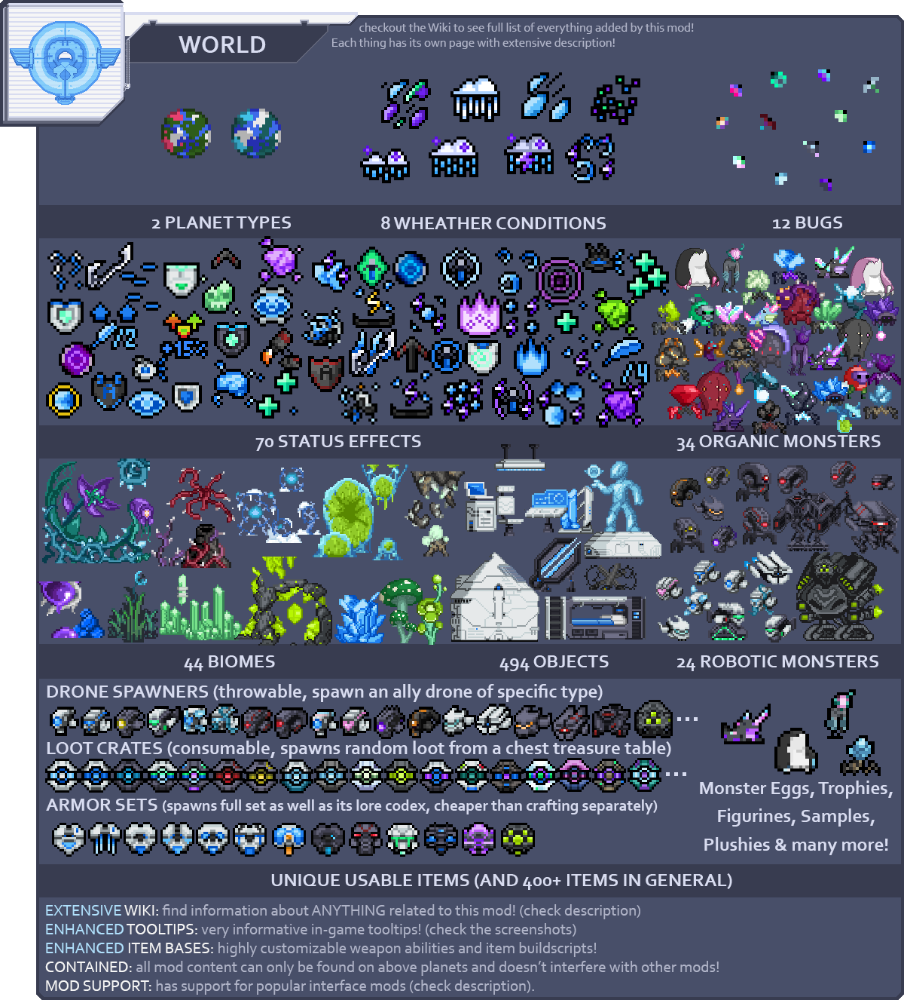
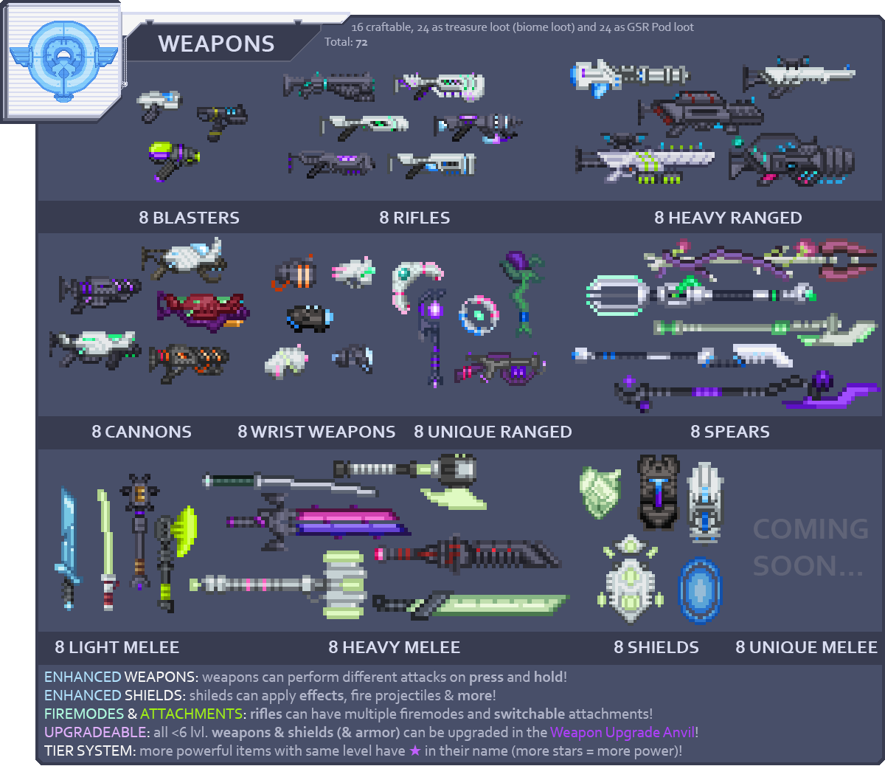
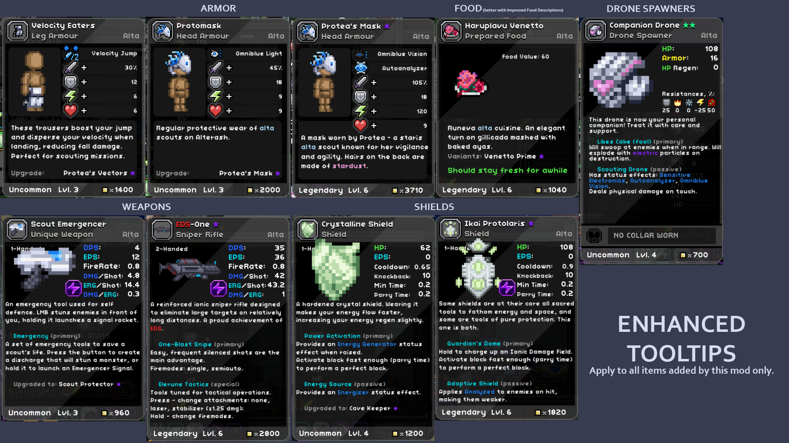
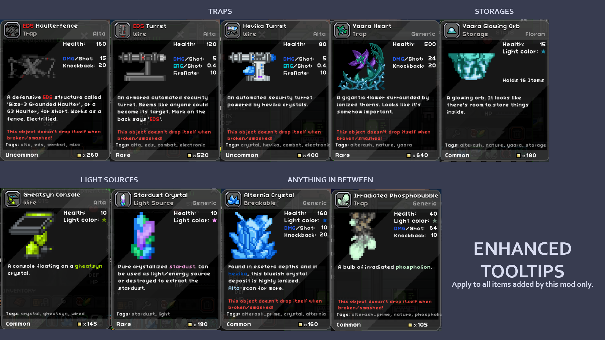
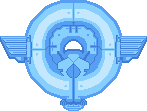

<h1 align="center">My Enternia</h1>

I made this little mod mainly for myself, but decided to share with everybody.  
This mod adds a new race, 2 new planets with their own biomes, monsters, many hazards and treasure. The mod adds new unique weapons, armor, cosmetics, augments/collars, spawners, codexes, throwables and other equipment.  
All new content **can only be found on those 2 planets**, is fairly balanced, and thus doesn't interfere with normal gameplay!  
Check out the end of the description for a **rundown of new content**. Or, even better, check out the official **Wiki**!

<h4 align="center">

[>>> OFFICIAL WIKI <<<](https://github.com/Ceterai/Enternia/wiki)</h4><h4 align="center">

[>>> SUPPORT THE MOD <<<](https://www.buymeacoffee.com/ceterai)</h4><h4 align="center">

[>>> DISCORD SERVER <<<](https://discord.gg/qBZDKESdtp)</h4>
(dev updates, mod-related questions, bug reporting, and lots of emojis and stickers! ^^)

**Version 2.2: Alta Colonies** is out! Check out the [changelog](.meta/changelog.md) for details.

Also, check out this helpful tenant guide: [My Enternia Wiki: Tenants](https://github.com/Ceterai/Enternia/wiki/Tenants)

- [Installation](#installation)
  - [Steam](#steam)
  - [GitHub](#github)
  - [Starbound Forums](#starbound-forums)
- [Where to start](#where-to-start)
- [Contents](#contents)
  - [Supported Addons](#supported-addons)
  - [Screenshots](#screenshots)
  - [Mod Content Rundown](#mod-content-rundown)
  - [Compatability](#compatability)
    - [Information For Modders](#information-for-modders)
    - [Information For Translators](#information-for-translators)
  - [Enhanced Tooltips](#enhanced-tooltips)
- [Changes](#changes)

## Installation

### Steam

Subscribe to this mod on Steam! [Link](https://steamcommunity.com/sharedfiles/filedetails/?id=2006558650)

### GitHub

1. Download the latest release or clone the repo;
1. Put the dowloaded/cloned folder into the `mods` folder in your Starbound directory.

### Starbound Forums

Get this mod on the official Chucklefish Forums: [Link](https://community.playstarbound.com/resources/my-enternia.6252/)

## Where to start

To explore the worlds added by this mod, try to find new planet types around tier 3+ stars!

To start progressing in the mod content, craft an  [Alta Crafting Station](https://github.com/Ceterai/Enternia/wiki/Alta-Crafting-Station)! It should be available at the tier 2 Inventor's Table.  
From there, you'll be able to craft:

- mod equipment (armor, weapons, throwables, etc);
- other mod crafting tables;
- all mod items that can normally be only found through loot (requires max tier).

Other crafting tables include:

-  [Alta Constructor](https://github.com/Ceterai/Enternia/wiki/Alta-Constructor) for crafting objects/decorations/traps (upgrading to max tier allows you to even craft natural objects and loot tables);
-  [Alta Datacenter](https://github.com/Ceterai/Enternia/wiki/Alta-Datacenter) for crafting codexes the tell you the lore and/or explain how certain mod items work (highly recommend to read them so you don't have to visit the wiki);
-  [Alta Upgrade Station](https://github.com/Ceterai/Enternia/wiki/Alta-Upgrade-Station) for upgrading some mod items in exchange for  [Gheatsyn Shards](https://github.com/Ceterai/Enternia/wiki/Gheatsyn-Shard).
-  [Deprecation Station](https://github.com/Ceterai/Enternia/wiki/Deprecation-Station) is a tiny crafting table that allows you to convert deprecated items/objects to new ones, or exchange Perfectly Generic Items for different presents.

## Contents

There's a [GitHub Wiki](https://github.com/Ceterai/Enternia/wiki) with full list of contents and extensive information on each resource!

### Supported Addons

- [Tabula Rasa](https://steamcommunity.com/sharedfiles/filedetails/?id=737353165) (some items are available at the table);
- [Improved Food Descriptions](https://steamcommunity.com/sharedfiles/filedetails/?id=731354142) (proper support for all effects added by this mod);
- [More Planet Info](https://steamcommunity.com/sharedfiles/filedetails/?id=1117007107) (proper support for all effects, weather and biomes of this mod);
- [True Space](https://steamcommunity.com/sharedfiles/filedetails/?id=730684624) (planets added by this mod are able to spawn near True Space stars.  [Alterash](https://github.com/Ceterai/Enternia/wiki/Alterash) can spawn as a mild/cool planet or satellite,  [Alterash Prime](https://github.com/Ceterai/Enternia/wiki/Alterash-Prime) as a cool/cold planet or satellite);
- [Race Traits](https://steamcommunity.com/sharedfiles/filedetails/?id=2622273194) (check mod screenshots for stats);
- [Frackin' Races](https://steamcommunity.com/sharedfiles/filedetails/?id=763259329)/[Frackin' Universe](https://steamcommunity.com/sharedfiles/filedetails/?id=729480149) (PARTIAL: no FU BYOS support. If you need it, you can get it here: [Alta FU Patch+](https://steamcommunity.com/sharedfiles/filedetails/?id=3048977458)).

### Screenshots

You can view screenshots on the [Steam page of the mod](https://steamcommunity.com/sharedfiles/filedetails/?id=2006558650).

### Mod Content Rundown

(Scroll down for information for modders)

More information on new weapon features like press&hold, firemodes, attachments and upgrading: [My Enternia Wiki: Weapons](https://github.com/Ceterai/Enternia/wiki/Weapons)

### Compatability

1. Doesn't require any other mods to work;
1. Should be FU-compatible.

#### Information For Modders

1. The mod uses regular Starbound folder structure so should be easy to navigate and integrate with;
1. All IDs added by the mod have a `ct_` prefix to make it impossible to conflict with IDs from other mods;
1. The mod tries to explore somewhat unusual concepts with unique names so there should be little to no idea overlap;
1. If you want to make a mod on top of this and want to learn modding-related features of this mod, visit this page: [My Enternia Wiki: Modding](https://github.com/Ceterai/Enternia/wiki/Modding);
1. Support for mods like IFD and MPI is done by generating patch files using python scripts. To learn more, visit [My Enternia Wiki: Modding - Mod Support](https://github.com/Ceterai/Enternia/wiki/Modding-Mod-Support).

#### Information For Translators

If you're looking to translate this mod to another language, here's the list of files & folders you should be on the lookout for:

- [`/codex`](codex)
- [`/items`](items)
- [`/monsters`](monsters)
- [`/objects`](objects)
- [`/stats/effects`](stats/effects) - mostly just effect names
- [`/interface/cockpit/cockpit.config.patch`](interface/cockpit/cockpit.config.patch) - Weather, Planet, Biome and Effect info (for the Cockpit interface* and More Planets Info mod)
- [`/radiomessages/exploration.radiomessages.patch`](radiomessages/exploration.radiomessages.patch) - radio messages
- [`/species/alta.species`](species/alta.species) - species name, description, slider tooltips
- [`/species/alta_namegen.config`](species/alta_namegen.config) - possible species names list
- [`/IFD_statuseffects.config.patch`](IFD_statuseffects.config.patch) - effect info for Improved Food Descriptions mod
- [`/items/buildscripts/ct_texts.config`](items/buildscripts/ct_texts.config) - tooltip text lines used in item tooltips

> Note that items, monsters, objects, etc. can contain a `wiki` field. This field contains info only displayed in mod Wiki, so can be ignored.

Starting with version [2.1.4a](github.com/Ceterai/Enternia/releases/tag/2.1.4a), each new version's changelog now contains a **Translation** section that goes over changes made in that version that might require attention from translators.

### Enhanced Tooltips

As mentioned in the content rundown, many different items in this mod have improved, informative tooltips. Below are some examples of that:

## Changes

For any recent and all progress, checkout: **[Changelog](.meta/changelog.md)**  
You can also find the full list of changes on the [Steam changelog page](https://steamcommunity.com/sharedfiles/filedetails/changelog/2006558650).

---

  

